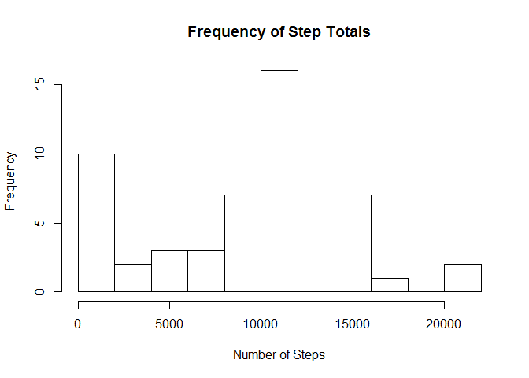
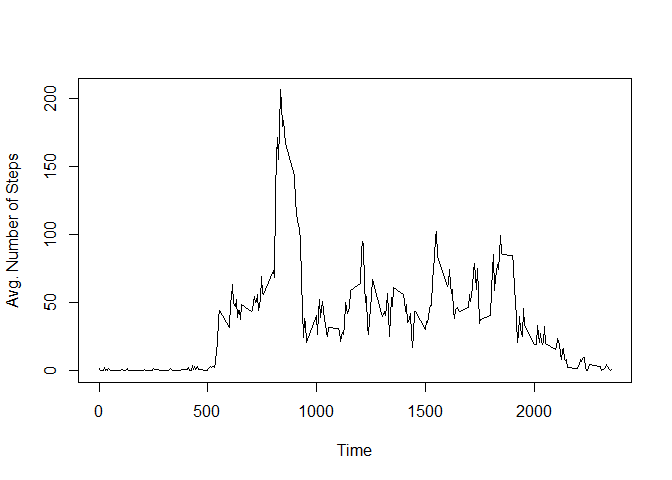

# Reproducible Research: Peer Assessment 1


## Loading and preprocessing the data

The first step will be to load the data and reshape it into a format which is more conducive to our analysis. 

For this, we will reshape the data into a table which specifies the number of steps for each time interval for each day. 

We will also calculate a vector of totals for each day, while ignoring the time periods for which there is no data.


```r
library(dplyr)
```

```
## Warning: package 'dplyr' was built under R version 3.2.5
```

```
## 
## Attaching package: 'dplyr'
```

```
## The following objects are masked from 'package:stats':
## 
##     filter, lag
```

```
## The following objects are masked from 'package:base':
## 
##     intersect, setdiff, setequal, union
```

```r
library(tidyr)
```

```
## Warning: package 'tidyr' was built under R version 3.2.5
```

```r
rm(list = ls()) # Clear the workspace
rawdata <- read.csv("activity.csv")
reshaped <- spread(rawdata, date, steps)
daytotals <- colSums(reshaped[, -1], na.rm = TRUE)
```


## What is mean total number of steps taken per day?

First we'll examine the total steps taken each day, starting with the frequency at which we numbers of of steps taken.


```r
hist(daytotals, breaks = 15, xlab = "Number of Steps", 
     main = "Frequency of Step Totals")
```

<!-- -->

We find that steps per day has a median of 1.0395\times 10^{4} and a mean of 9354.2295082.


## What is the average daily activity pattern?

As a way to examine daily step patterns we'll look at the average for each time interval, once again ignoring na values.


```r
reshaped$meansteps <- rowMeans(reshaped[, -1], na.rm = TRUE)
plot(reshaped$interval, y = reshaped$meansteps, type = "l", xlab = "Time", ylab = "Avg. Number of Steps")
```

<!-- -->

We find that the time interval 835 has the maximum average steps.


## Imputing missing values

Our analysis to this point has ignored the na values in the data. A quick check finds that there are a total of 2304 na vales.

For a slightly more accurate examination of the data, we'll replace each na value with the previously determined mean for the time interval in which it occurs.

Plotting this new data set, we see that the time series looks exactly the same.


```r
namap <- is.na(reshaped) # Generate a map of the na values
reshaped[namap] <- reshaped$meansteps
plot(reshaped$interval, y = reshaped$meansteps, type = "l", xlab = "Time", ylab = "Avg. Number of Steps")
```

<!-- -->

```r
daytotals <- colSums(reshaped[, -1], na.rm = TRUE)
```

With this new dataset, we find that steps per day has a median of 1.0766189\times 10^{4} and a mean of 1.0766189\times 10^{4}.


## Are there differences in activity patterns between weekdays and weekends?

It may be useful to examine the differences between step totals on wekkends vs weekdays. Here we have a side by side comparison of the two.


```r
library(lattice)

newdata <- rawdata
newdata$date <- ifelse(weekdays(as.Date(rawdata$date)) %in% c("Saturday", "Sunday"), 
                       "Weekend", "Weekday")
newdata$date <- factor(newdata$date,levels=c("Weekday","Weekend"))

newdata2 <- aggregate(steps~interval+date,newdata,mean)

xyplot(steps~interval|factor(date),data=newdata2,type="l", xlab = 'Interval', 
       ylab = 'Number of Steps',layout = c(1,2))
```

<!-- -->
